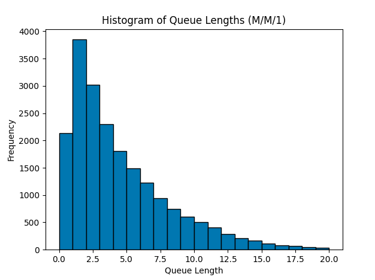
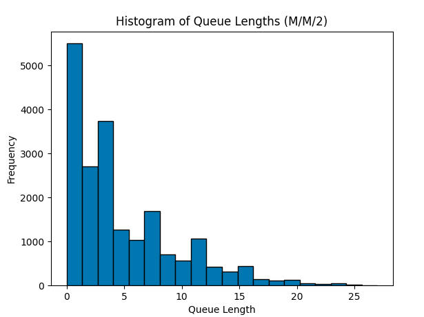
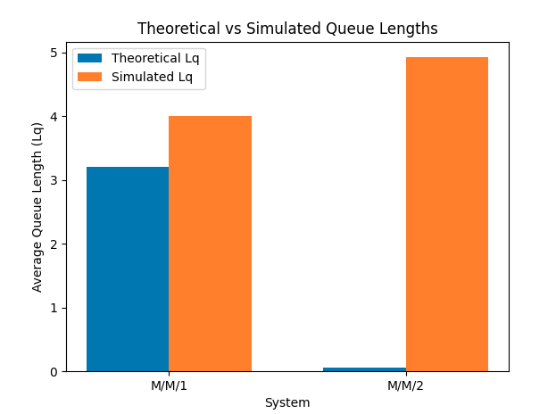

### CSEE6180: Modeling and Performance Evaluation

### Homework Assignment 3

```
Name: Shivam Shekhar
UNI: ss6960
```

#### Directory Structure

```
├── README.md
├── mm1_queue_simulator.py
└── mm2_queue_simulator.py
```

#### System Requirements

1. Any OS (Mac/Windows/Linux)
2. python3.8 and higher
3. Terminal

#### Packages Required

1. numpy
2. matplotlib
3. random
4. argparse

#### Instructions to Run the code

For both the code files `mm1_queue_simulator` and `mm2_queue_simulator`, we have option to run the code with command line arguments (parameters) or with default values.

Example: Command to run `mm1_queue_simulator`:

```
python3 mm1_queue_simulator.py --arr_rate 0.7 --ser_rate 1.2 --total_customers 5000
```

Example: Command to run `mm2_queue_simulator`:

```
python3 mm2_queue_simulator.py --arr_rate 0.7 --ser_rate 1.2 --total_customers 5000
```

#### Output:

The output is designed in phases:

1.  **Phase 1: Input Parameters**

- Displays the simulation parameters such as arrival rate (λ), service rate (μ), total customers, and the number of servers (for mm2_queue_simulator).

- Example:

```
Simulation Parameters:
Arrival Rate (λ): 0.7
Service Rate (μ): 1.2
Total Customers: 5000
Number of Servers: 2
```

2. **Phase 2: Key Performance Metrics**

- Computes and displays the following metrics:

  - Theoretical and simulated average queue length (Lq).
  - Theoretical and simulated average response time (W).
  - Simulated server utilization.

- Example:

```
Performance Metrics:
Theoretical Average Queue Length (Lq): 1.57
Simulated Average Queue Length (Lq): 1.63
Theoretical Average Response Time (W): 2.24
Simulated Average Response Time (W): 2.31
Simulated Server Utilization: 58.33%
```

3. **Phase 3: Visualizations**

- Provides graphical output for a detailed analysis:
  - A histogram of observed queue lengths during the simulation, showing their frequency distribution.
  - A comparison plot of theoretical vs. simulated queue length distributions.

Example:







4. **Comparison Between M/M/1 and M/M/2**

- For the mm2_queue_simulator, the output compares M/M/1 and M/M/2 systems:
  - Highlights differences in queue length, response time, and server utilization under the same total service capacity.

Example:

```
Comparison of M/M/1 and M/M/2:
System: M/M/1
Theoretical Average Queue Length (Lq): 2.33
Simulated Average Queue Length (Lq): 2.45
Theoretical Average Response Time (W): 3.33
Simulated Average Response Time (W): 3.41
Simulated Server Utilization: 70.00%

System: M/M/2
Theoretical Average Queue Length (Lq): 1.11
Simulated Average Queue Length (Lq): 1.16
Theoretical Average Response Time (W): 2.14
Simulated Average Response Time (W): 2.21
Simulated Server Utilization: 35.00%
```
